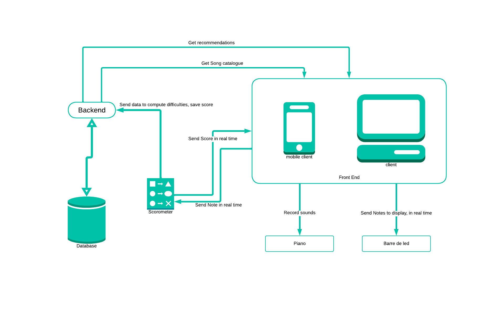

# 

La principale raison pour laquelle on arrête de jouer d'un instrument est la perte de motivation. C'est un apprentissage long et vraiment demandant. ChromaCase propose d'accompagner les joueurs de piano grâce à une application mobile avec une expérience personnalisée. Celle-ci, générée par une IA, cible les goûts et identifie les difficultés du joueur.

Ça vous interesse? Rendez-vous sur notre [site](https://chromacase.studio/) pour prendre contact

## Structure du Projet

